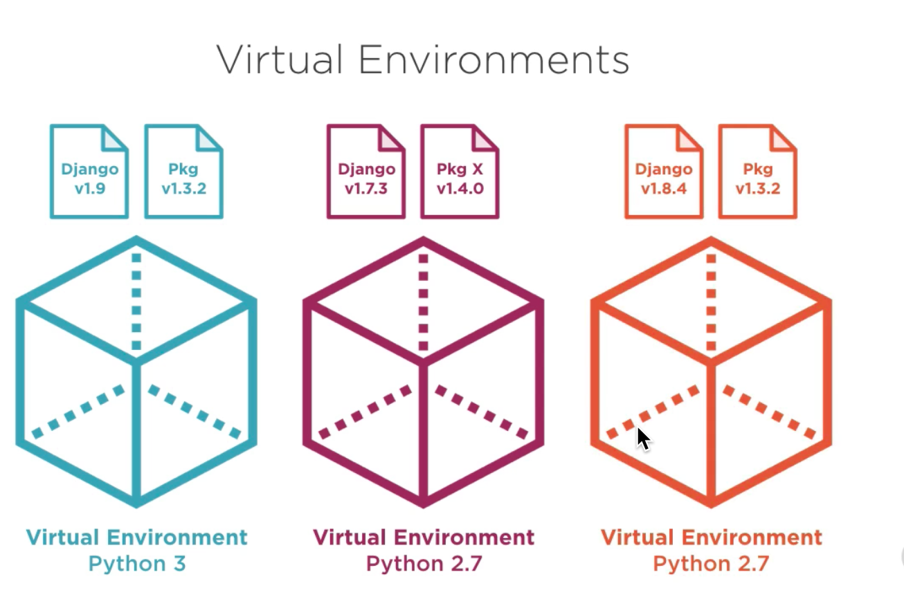

# 1. Django 

<!-- TOC -->

- [1. Django](#1-django)
	- [1.1. Admin Template Project](#11-admin-template-project)
	- [1.2. Virtual Environments](#12-virtual-environments)
	- [1.3. Adding Django App](#13-adding-django-app)
		- [1.3.1. Settings Changes](#131-settings-changes)
	- [1.4. Adding Database Models](#14-adding-database-models)
	- [1.5. Adding Serializers](#15-adding-serializers)
	- [1.6. Adding Views](#16-adding-views)

<!-- /TOC -->

## 1.1. Admin Template Project

The following files are created by the `django-admin startproject todobackend` command


- top level folder (todobackend) is called `project-root`
- manage.py : performs project tasks
- internal folder is called `django-root`
- settings.py - configuration settings for the project
- urls.py - route http requests 
- wsgi.py - allows apache or nginx servers to pipe http requests into the application


For the purpose of CD, we need to change `project-root` name to `src`.

## 1.2. Virtual Environments

Virtual environments allow python applications to run in sandboxed environment - including specific version of python



- Install virtual environments

```
pip3 install virtualenv
```

- Create virtual environment
```
virtualenv create venv
```


Activate virtual environment and add frameworks

```
source venv/bin/activate
pip3 install django==1.9
pip3 install djangorestframework==3.3
pip3 install django-cors-headers==1.1
```

## 1.3. Adding Django App

- Add an app to our setup

```
source venv/bin/activate
python src/manage.py startapp todo
```

### 1.3.1. Settings Changes
- Add the frameworks and apps to [src/todobackend/settings.py]() in installed_apps

```python
INSTALLED_APPS = [
    'django.contrib.sessions',
    'django.contrib.messages',
    'django.contrib.staticfiles',
    'rest_framework', #--add
    'corsheaders', #--add 
    'todo'  #--add
]

```

- Add CORS middleware to `MIDDLEWARE_CLASSES`

```python
MIDDLEWARE_CLASSES = [
    'django.middleware.security.SecurityMiddleware',
    'django.contrib.sessions.middleware.SessionMiddleware',
    'corsheaders.middleware.CorsMiddleware', #<--- add this, order is important
    'django.middleware.common.CommonMiddleware',
    'django.middleware.csrf.CsrfViewMiddleware',
    'django.contrib.auth.middleware.AuthenticationMiddleware',
```

- Allow CORS for all origins

```python
# CORS Settings
CORS_ORIGIN_ALLOW_ALL = True
```

## 1.4. Adding Database Models

- Add `TodoItem` model to the [/src/todo/models.py]()
- Add a migration as below:

```bash
source venv/bin/activate
python src/manage.py makemigrations todo
```

- Run a migration as below

```bash
source venv/bin/activate
python src/manage.py migrate
```

This will create an initial database at [src/db.sqlite3]()

## 1.5. Adding Serializers
- PyCharm cannot read references if [venv]() folder is outside of [src]().
- I have updated all the scripts to move [venv]() folder inside of [src]().

We add a hyperlinked serializer as below in a new file [serializers.py]() under the [todo]() folder

```py
from rest_framework import serializers
from todo.models import TodoItem


class TodoItemSerializer(serializers.HyperlinkedModelSerializer):
    url = serializers.ReadOnlyField()

    class Meta:
        model = TodoItem
        fields = ("url", "title", "completed", "order")
```

## 1.6. Adding Views

Reference: http://www.django-rest-framework.org/api-guide/views

We add a derived class of `ModelViewSet` and setup create and delete actions as below:

```py
from django.shortcuts import render

from todo.models import TodoItem
from todo.serializers import TodoItemSerializer
from rest_framework import status
from rest_framework import viewsets
from rest_framework.reverse import reverse
from rest_framework.decorators import list_route
from rest_framework.response import Response


class TodoItemViewSet(viewsets.ModelViewSet):
    queryset = TodoItem.objects.all()
    serializer_class = TodoItemSerializer

    def perform_create(self, serializer):
        instance = serializer.save

        instance.url = reverse('todoitem-detail', args=[instance.pk], request=self.request)
        # format: http://<fqdn>:<port>/todos/<primarykey>
        # example: http://localhost:8000/todos/15

        instance.save()

    def delete(self, request):
        TodoItem.objects.all().delete()
        return Response(status=status.HTTP_204_NO_CONTENT)
```

## 1.7. Troubleshooting

### 1.7.1. ModuleNotFoundError: No module named 'ConfigParser'

https://stackoverflow.com/questions/14087598/python-3-importerror-no-module-named-configparser
https://stackoverflow.com/questions/49977768/error-datetime-datetime-object-has-no-attribute-split-in-django-1-11-4/50546125#50546125

instead of :

```

source src/venv/bin/activate
pip3 install mysql-python
```

Use this:
```
brew install mysql
pip3 install mysqlclient
source src/venv/bin/activate
pip3 install mysqlclient
```

## 1.8 Bash Color Codes

See http://linuxmanage.com/colored-man-pages-log-files.html

## 1.9 Django KeyError

I was unable to run tests with `make test`

### 1.9.1 Issue
Got this error

```
...
e 189, in connect
test_1     |     self.connection = self.get_new_connection(conn_params)
test_1     |   File "/appenv/local/lib/python2.7/site-packages/django/db/backends/mysql/base.py", line 276, in get_new_connection
test_1     |     conn.encoders[SafeBytes] = conn.encoders[bytes]
test_1     | KeyError: <type 'str'>
```

### 1.9.2 Solution

See https://github.com/PyMySQL/mysqlclient-python/issues/306

This is caused by the docker script resolving mysql client to > 1.3.14 version. 
Changing it to  == 1.3.14 fixed the issue (in setup.py):

```py
 install_requires = [ "Django>=1.9, <2.0",
                         "django-cors-headers>=1.1.0",
                         "djangorestframework>=3.3.0",
                         "mysqlclient==1.3.14", #<--- changed from >=
                         "uwsgi>=2.0", # communicates with NGINX
```