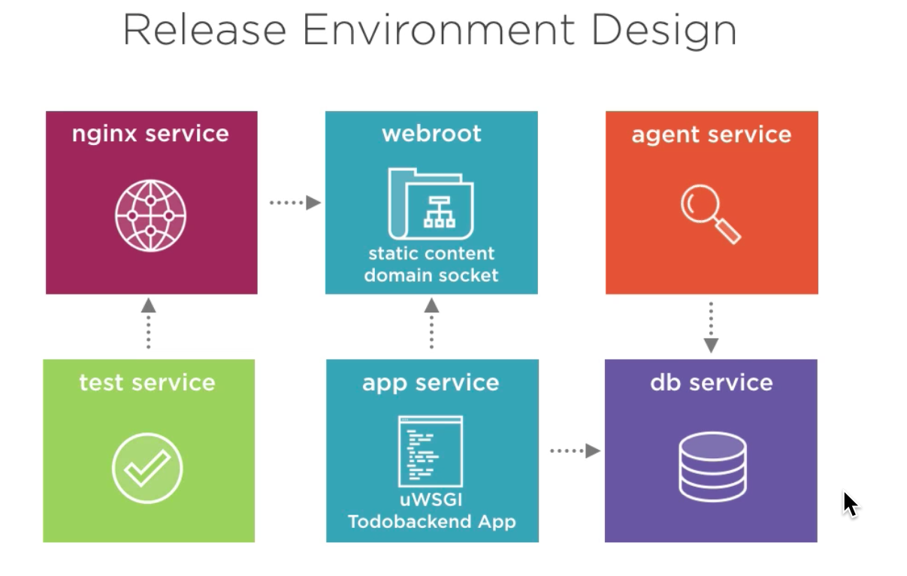

# Setup.py
Is the universal standard for specifying build metadata in python.


##  Get requirements.txt from setup.py
- Change content of requirements.txt to use "."
- This will invoke "pip install ."

## Get requirements_test.txt from setup.py
- Change content of requirements_text.txt to
```
-e .[test]
```
- `e` is editable flag
- `.[test]` tells pip to install the "test" array of dependencies in the extras_require setting of setup.py

##  Setup.Py vs Requirements.txt
See https://caremad.io/2013/07/setup-vs-requirement/


## MANIFEST.in
See https://docs.python.org/2/distutils/sourcedist.html#the-manifest-in-template

# Release Environment

Design:


## uWSGI options

http://uwsgi-docs.readthedocs.org/en/latest/Options.html

- `ports` will expose a port to outside world
-  `expose` will only allow internal comm